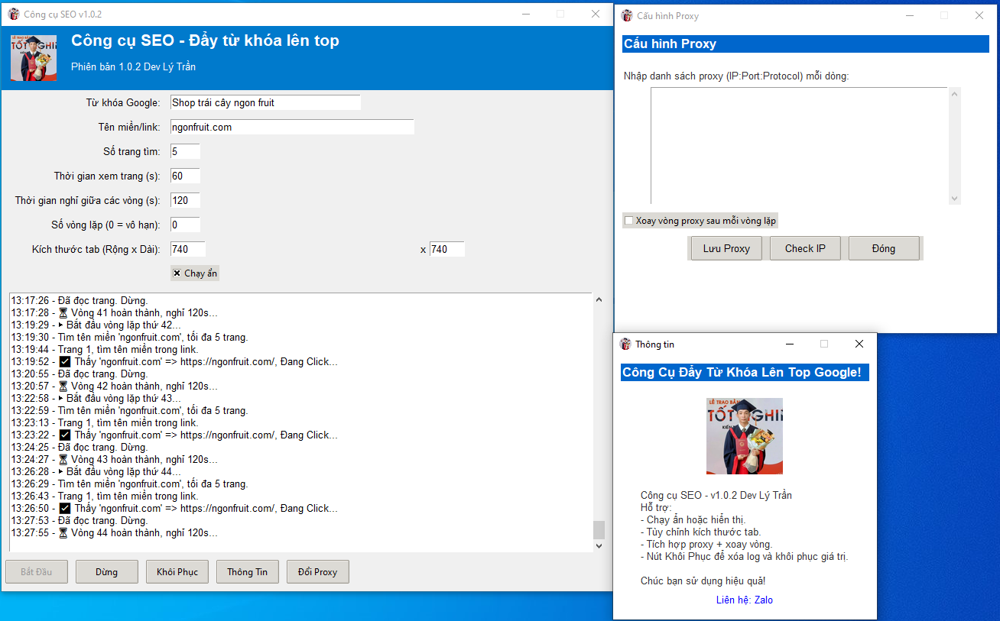

# Tool SEO

**Tool SEO** là một ứng dụng tự động tìm kiếm từ khóa trên Google, truy cập và cuộn trang tại một domain được chỉ định, giúp tối ưu SEO và phân tích dữ liệu. Ứng dụng hỗ trợ **Proxy**, **tùy chỉnh thông số vòng lặp**, **mô phỏng hành vi người dùng**, và có giao diện **trực quan, dễ sử dụng**.

---

## **Tính năng chính**
✅ **Tự động tìm kiếm từ khóa trên Google**  
✅ **Truy cập vào domain cần tìm nếu có trong kết quả**  
✅ **Mô phỏng hành vi người dùng (cuộn trang, đọc nội dung)**  
✅ **Tùy chỉnh số trang tìm kiếm, thời gian xem trang, thời gian nghỉ vòng lặp**  
✅ **Hỗ trợ Proxy (xoay vòng Proxy, kiểm tra IP)**  
✅ **Giao diện trực quan, dễ sử dụng**  
✅ **Dừng chương trình dễ dàng bằng một nút bấm**  

---

## **Cách hoạt động**
1. **Mở trình duyệt Chrome ở chế độ mobile** *(360×740)*.  
2. **Nhập từ khóa**, **domain**, **số trang tìm**, **thời gian đọc trang**, **số vòng lặp**, sau đó bấm **Bắt Đầu**.  
3. Tool sẽ tìm kiếm trên **Google**, **cuộn trang**, và kiểm tra các kết quả.  
4. **Nếu tìm thấy domain**, tool sẽ **click vào link**, **cuộn trang**, **đọc nội dung** trong khoảng thời gian đã đặt.  
5. Sau mỗi vòng lặp, tool sẽ **đóng tab**, **nghỉ X giây**, rồi tiếp tục vòng tiếp theo.  
6. **Bấm "Kết Thúc"** để dừng tool và thoát khỏi chương trình.  

---

## **Yêu cầu**
🔹 **Python 3.7+**  
🔹 **Google Chrome** *(đảm bảo đúng phiên bản với chromedriver.exe)*  
🔹 **Thư viện cần cài đặt**:

---
## **Tả xuống công cụ có sẵn**

🔹 Vào thư mục **dist** -> **ToolSEO.exe** tải về và sử dụng thôi!

---

## **Đóng gói file .exe**

🔹 Cài đặt thư viện: **pip install selenium pillow requests**.

🔹 Nếu thư ciện cũ thì cập nhật lên: **pip install --upgrade pillow**.

🔹 Đặt các file **chromedriver.exe, lytran.ico, lytran.jpg** cùng thư mục với file **.py**.

🔹 Đóng gói tất cả các file exe:

    pyinstaller --onefile ^

    --windowed ^
    
    --name "Tool SEO" ^
    
    --icon "lytran.ico" ^
    
    --add-data "chromedriver.exe;." ^
    
    --add-data "lytran.ico;." ^
    
    --add-data "lytran.jpg;." ^
    
    toolseo.py**